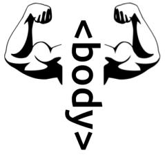

## BodyBuilder
 

 
BodyBuilder is a simple jQuery lib that gives a few tools to add DOM elements in different fashion.

### Setup
```html
 <script src="src/builder.js"></script>
```
### Usage
BB works with standart jQuery selectors `$('body/.class/#id')` to append them to particular place.
By chaining methods you can dynamicly create and add DOM elements.
**Example** :exclamation:
```javascript
var employees = ['Leonard','Brady','Melisa','Anastasia','Lucy'],
    button = {"class":"btn btn-secondary dropdown-toggle","type":"button", "id":"dropdownMenuButton", "data-toggle":"dropdown", "aria-haspopup":"true", "aria-expanded":"false"};
$('body').tag('div',{'class':'dropdown'})
          .tag('button','Employee of the year',button).nest()
          .tag('div',{'class':'dropdown-menu','aria-labelledb':'dropdownMenuButton'})
              .tag('a',{'class':'dropdown-item'}).twin(employees,'value').allIn().nest()
              .print();
```
##### Methods
#### .tag()
```javascript
.tag('div','Content',{'class':'class_property'});
.tag('div');
```
`tag()` method allows you to add infinite different elements in chain. **First parametr** defines the tag itself, **second argument** for content (not required :interrobang: ) and **third argument is for all attributes you want to put in. Require `print()` method after last tag in chain.
#### .stag()
```javascript
.stag('p','Content',{'options':'options'});
``` 
`stag()` does almost the same except it doesn't require `print()` at the end and uses for single tags to be print right away.
#### .nest()
```javascript
.nest();
.nest(2);
```
`nest()` places tags into each other, **number type argument** specify how many elements become children. If argument not specified, it will make all tag children of first element.
```javascript
$('body').tag('div','Parent',{'class':'parent'})
  .tag('div','Potential child_1',{'class':'child'})
  .tag('div','Potential child_2',{'class':'child'})
  .tag('div','Potential child_3',{'class':'child'})
  // <- No nest method
  .print();

```

```javascript
$('body').tag('div','Parent',{'class':'parent'})
  .tag('div','Potential child_1',{'class':'child'})
  .tag('div','Potential child_2',{'class':'child'})
  .tag('div','Potential child_3',{'class':'child'})
  .nest() // <-Nest method without argument
  .print();
```

```javascript
$('body').tag('div','Parent',{'class':'parent'})
  .tag('div','Potential child_1',{'class':'child'})
  .tag('div','Potential child_2',{'class':'child'})
  .tag('div','Potential child_3',{'class':'child'})
  .nest(1) // <- Nest with argument
  .print();
```

#### .twin()
```javascript
.twin([Array],'value');
.twin(5);
```
For this moment `twin()` method offers next features: You can pass an Array as a **first argument** and attribute value as a **second argument** that will obtain Array value by each iteration. In the same time you can just pass **number type argument** and it iterate so many times.
#### .allIn()
```javascript
.allIn();
```
`allIn()` moves all just created elements by `twin()` into element that was before this clones. **No argument require**.
#### .print()
```javascript
.print()
```
`print()` method prints out and appends element node inside and at the end of selected DOM element. Required for `tag() nest() allIn() twin()` methods.

